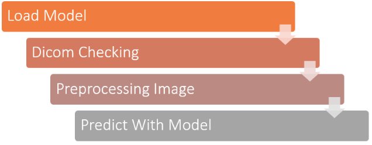
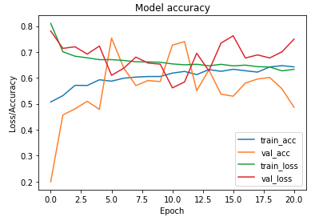
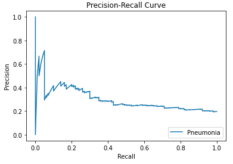
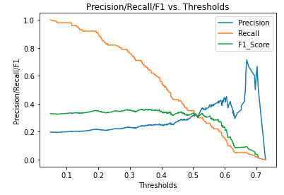
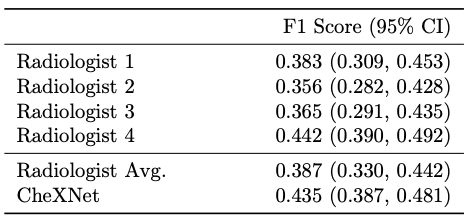

# FDA  Submission

**Your Name: Nguyen Nhat Anh Vo**

**Name of your Device: Pneumonia Detector**

## Algorithm Description 

### 1. General Information

**Intended Use Statement:** Assisting radiologists in detecting pneumonia in Chest X-ray images with the view of PA/AP.

**Indications for Use:** It is well-used for both male and female from 1-100 years old. Patient can also exihit other diseases (Atelectasis, Cardiomegaly, Consolidation, Edema, Effusion, Emphysema, Fibrosis, Hernia, Infiltration, Mass, Nodule, Pleural_Thickening, Pneumonia, Pneumothorax) in comorbid with pneumonia.

**Device Limitations:** Require high-power processing GPU card to run the algorithm.

**Clinical Impact of Performance:** 

### 2. Algorithm Design and Function

**DICOM Checking Steps:** Perform 3 different DICOM checks
- Check patient position: Only AP or PA view will be processed
- Check image type (modality): Only DX type will be processed
- Check body part examined: Only chest taken image will be process

**Preprocessing Steps:** Rescale the image by dividing by 255.0, then normalize the image with the mean and standard deviation retrieved from the training data. Finally, resize the image to (1, 224, 224, 3) to fit in the network.

**CNN Architecture:**
- VGG19 model architecture is used for transfer learning. 

- Several custom layers are also added to the VGG19.

### 3. Algorithm Training

**Parameters:**
- Augmentation used: 
	- Horizonal Flip
	- Height Shift Range = 0.1
	- Width Shift Range = 0.1
	- Rotation Range = 20
	- Shear Range = 0.1
	- Zoom Range = 0.1
* Batch size = 32
* Optimizer learning rate = 3e-4
* Layers of pre-existing architecture that were frozen: First 20 layers
* Layers of pre-existing architecture that were fine-tuned: None
* Layers added to pre-existing architecture:
	* Flatten
	* Dropout 0.5
	* Dense 1024, Activation = ReLU
	* Dropout 0.5
	* Dense 512, Activation = ReLU
	* Dropout 0.5
	* Dense 256, Activation = ReLU
	* Dense 1, Activation = Sigmoid

**Final Threshold and Explanation:**

- Based on the F1-Score vs Threshold Chart, to balance between the Precision and Recall, the threshold of 0.728 will give the max value of F1-Score. 

### 4. Databases
- The databases contains 112,120 X-Ray images. The number of Pneumonia Positive images is only 1430 (1.27%).
- Therefore, to split the databases for training, I will have to:
  - Obtain all the postive cases of Pneumonia.
  - Divide the positive cases into 80%-20% for the Training and Validation Dataset.
 
**Description of Training Dataset:** 
- Balance the number of negative and positive cases in the training data.

**Description of Validation Dataset:** 
- Make the number of negative cases 4 times bigger the positive cases to somehow reflect the real-world clinical setting

### 5. Ground Truth

- The ground truth is NLP-derived labels. NLP at this stage is not complex enough to capture all the existing information of the reports. Hence, the accuracy is roughly 90%.

### 6. FDA Validation Plan

**Patient Population Description for FDA Validation Dataset:**
- Male and female patients in the age of 1 to 100. The gender distribution is slightly toward Male patient, the male to female ratio is approximately 1.2
- The patient may exihibit the following comorbid with Pneumonia: Atelectasis, Cardiomegaly, Consolidation, Edema, Effusion, Emphysema, Fibrosis, Hernia, Infiltration, Mass, Nodule, Pleural_Thickening, Pneumonia, Pneumothorax - 
- The X-Ray Dicom file should has the following properties: 
	- Patient Postition: AP or PA
	- Image Type: DX
	- Body Part Examined: CHEST

**Ground Truth Acquisition Methodology:**
- Establish a silver standard of radiologist reading

**Algorithm Performance Standard:**

- The F1-Score should be approximately 0.435 to out-perform the current state-of-the-art method (CheXNet) [https://arxiv.org/pdf/1711.05225.pdf]